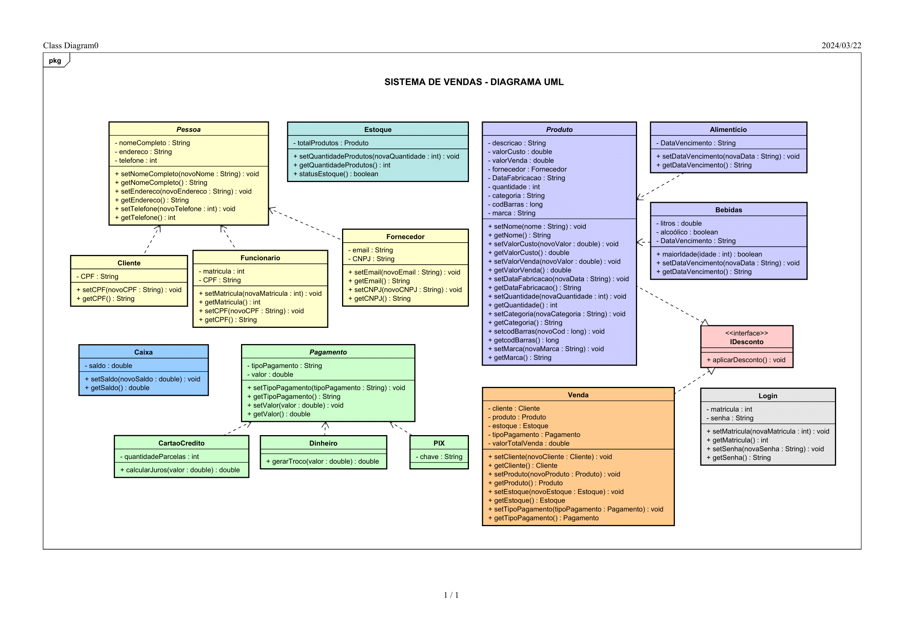

## Sistema de vendas para mercado

Estou desenvolvendo este sistema para consolidar os meus conhecimentos do que vim aprendendo da linguagem Java. Neste programa pude aplicar os principais conceitos de orientação a objetos, como:

- Encapsulamento
- Herança
- Polimorfismo
- Classes Abstratas
- Construtores
- Interface

Além de trabalhar com listas e estruturas de repetição. O projeto ainda não está finalizado, pretendo implementar o banco de dados e integrar com uma API talvez.
Antes de desenvolver o projeto, criei um diagrama UML que apesar de ter sofrido algumas alterações durante a criação do código, me serviu como uma boa base para pensar no conceito do negócio em geral e trabalhar no relacionamento entre os objetos e a herança de classes.

## DIAGRAMA UML

